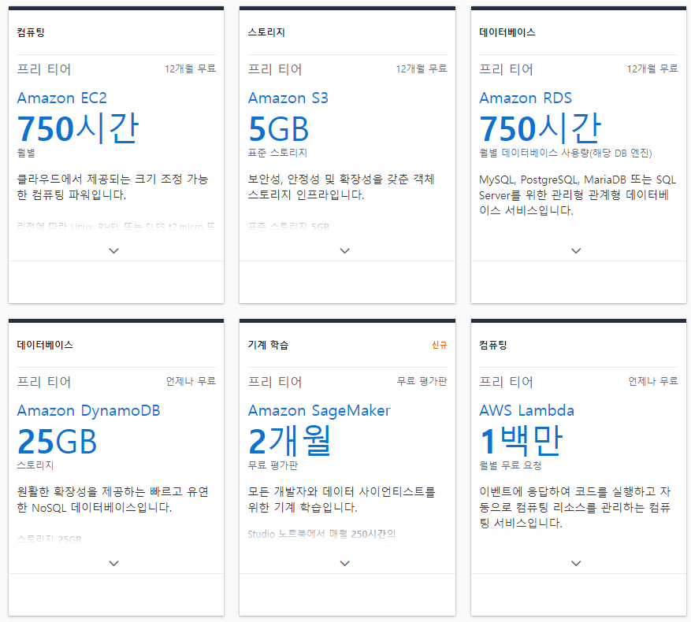
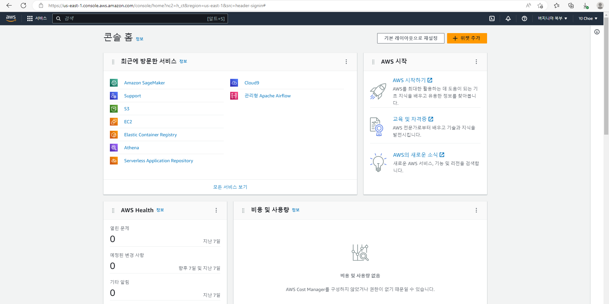
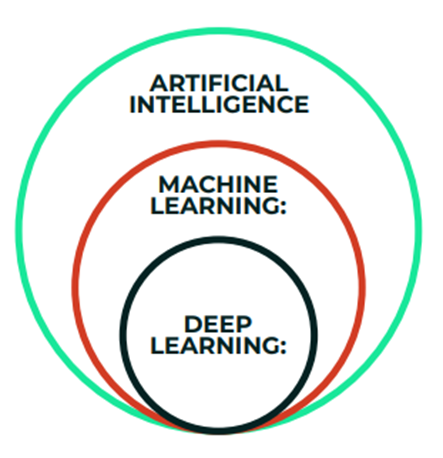
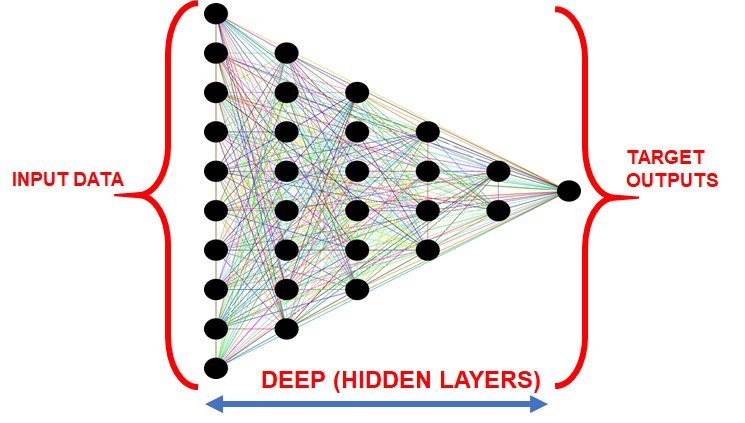

# Section2
AI/ML, 클라우드 컴퓨팅 소개   
   
   
# 목차
1. [AWS 프리 티어 계정 설정 및 개요](#AWS-프리-티어-계정-설정-및-개요)
2. [AI, 머신러닝, 딥러닝 소개](#AI-머신러닝-딥러닝-소개)
3. [좋은 데이터 vs 나쁜 데이터](#좋은-데이터-vs-나쁜-데이터)   
   
---   
   

# AWS 프리 티어 계정 설정 및 개요
   
AWS 는 위와 같이 무료로 사용해 볼 수 있다   
자세한 내용은 아래에서 확인해볼 수 있다   
   
   
https://aws.amazon.com/ko/free/?all-free-tier.sort-by=item.additionalFields.SortRank&all-free-tier.sort-order=asc&awsf.Free%20Tier%20Types=*all&awsf.Free%20Tier%20Categories=*all   
   
   
   
AWS 콘솔 홈은 위와 같다   
   
https://us-east-1.console.aws.amazon.com/console/   
   
   
   
# AI, 머신러닝, 딥러닝 소개
Machine Learning Components?   
> 1. Data + 2. Model + 3. Compute   
>> 1. Data: 우리는 많은 양의 데이터가 필요함. 이 데이터를 얻을 방법은 몇개의 강의를 통해 보여줄 예정   
>> ex) 어떤 종류가 있는지, 어떤 문제가 있는지   
>> 2. Model: 분류를 사용할지, 회귀를 사용할지 또는 강화학습을 수행할지 등등 어떤 유형의 알고리즘을 사용할지 혹은 어떤 유형의 모델을 사용할지 선택해야 함   
>> ex) 연속적 또는 숫자형 output 을 예측 -> 회귀 사용 OR 환자가 암인지 아닌지 예측 -> 분류 사용   
>> 3. Compute: 모델을 학습시키기 위해선 컴퓨팅 성능이 필요함 ex) cpu or gpu   
   
   
Artifical Intelligence VS Machine Learning VS Deep Learning   
   
## AI (Artifical Intelligence)
AI는 컴퓨터가 의사결정, 문자처리 그리고 시각적 인식과 같은 인간의 지능을 모방할 수 있도록 하는 과학   
AI는 위의 그림에서 보았다시피 광범위한 범위   
즉 로봇공학, 컴퓨터 비전, 머신러닝과 같은 여러개의 하위 분야를 포함하고 있음   
   
   
## ML (Machine Learning)
인공지능의 하위 분야로 겅험을 바탕으로 주어진 작업을 개선할 수 있는 머신 (여기서 핵심 단어는 경험!)   
따라서 머신 러닝은 지식과 데이터 그리고 경험을 통해 시간이 지날수록 더 나아지고 학습하고 있음   
또한 모든 머신 러닝 기술은 인공지능으로 분류되지만 인공지능을 머신 러닝으로 간주할 수는 없음   
> ex) 인공지능으로 분류될 수 있는 규칙 기반의 어떤 엔진은 머신 러닝에 속하지 않음   
> 왜냐하면 경험이 기반이 되지 않았으므로!   

## DL (Deep Learning)
딥러닝은 이미지와 같이 대용량 데이터가 사용되는 심층 인공 신경망을 기반으로 하는 머신 러닝의 전문분야   
인공 신경망이란 인간의 뇌에서 영감을 받아 만들어진 정보 처리 모델   
   
인간의 뇌는 화학적, 전기적 신호를 사용해 서로 소통하는 뉴런을 가지고 있는데, 이와 비슷하게 딥러닝은 다양한 가중치로 연결된 뉴런들이 여러 겹으로 배열되어 거대한 심층 구조 네트워크를 구축하는 것임   
따라서 딥러닝은 Input Layer가 있고, 여러 Hidden Layer 들이 있음
인간의 뇌는 서로 소통하는 수십억개의 뉴런들로 이루어져 있고 이 모든 뉴런은 우리가 보고 느끼고 결정할 수 있게 도와줌   
우리가 하고자 하는 딥러닝이란 컴퓨터의 수많은 방정식을 이용해 인위적으로 이런것을 구축해보는 일   
   
   
## Machine Learning VS Deep Learning
딥러닝과 머신 러닝의 차이점은 기능을 자동으로 추출하는 능력   
이것은 딥러닝의 능력   
> ex) 개와 고양이의 이미지를 분류하고자 할 때, 머신 러닝의 경우 Feature 들을 수동으로 추출해야 함   
> 하지만 딥러닝의 경우 Feature 들을 자동으로 추출하고 더 나아가 자동으로 분류까지 해 줌   
    
   
## Machine Learning: Big Picture
### Supervised Learning, Unsupervised Learning, Reinforcement Learning < ML < AI   
   
* Supervised Learning: 정답 값이 있는 입/출력 데이터를 사용해서 알고리즘을 학습   
  * 입력을 알고 정답도 알고 출력할 결과 또한 알고 있음   
    * ex) 고양이에 대한 이미지가 있고, 이 이미지는 고양이를 의미한다는 라벨을 가지고 있음   
  * 이 다음 입/출력 데이터를 사용해 지도방식 알고리즘으로 training   
  * 지도학습의 보통 크게 2가지: 분류 또는 회귀   
    * 분류: 두가지의 결과가 있을 때 발생 (불연속의 Output)   
    * ex) 환자가 암에 걸렸거나/걸리지 않았거나   
    * ex) 고객이 행복하거나/행복하지 않거나   
  * 회귀: 연속되는 결과를 예측   
    * ex) 주가, 매출액 예측 등   
   
* Unsupervised Learning: 라벨이 없는 데이터를 사용해서 알고리즘을 학습 (단지 입력 데이터만 갖고 있음)      
  * ex) 고양이에 대한 이미지면, 이 이미지는 고양이를 의미한다는 라벨을 가지고 있지 않고, 알고리즘 스스로 패턴을 학습   
  * 그 이후 여러 데이터들 중 해당 패턴을 가진 이미지끼리 분류      
  * 비지도 학습의 전략은 보통 군집화(그룹화)   
    * ex) 서로 다른 무리로 고객들을 그룹화
   
* Reinforcement Learning: 알고리즘이 누적된 보상을 극대화하기 위해 조치를 취하는 것   
   
   
# 좋은 데이터 vs 나쁜 데이터
   
   
# AWS 및 클라우드 컴퓨팅 소개
   
   
# 머신러닝 주요 컴포넌트 및 AWS Management Console 둘러보기
   
   
# AWS 리전 및 가용 영역
   
   
# 아마존 S3
   
   
# 아마존 EC2와 IAM
   
   
# AWS SageMaker 개요
   
   
# AWS SageMaker 세부 내용
   
   
# AWS SageMaker 스튜디오 개요
   
   
# AWS SageMaker 스튜디오 세부 내용
   
   
# SageMaker 모델 개발
